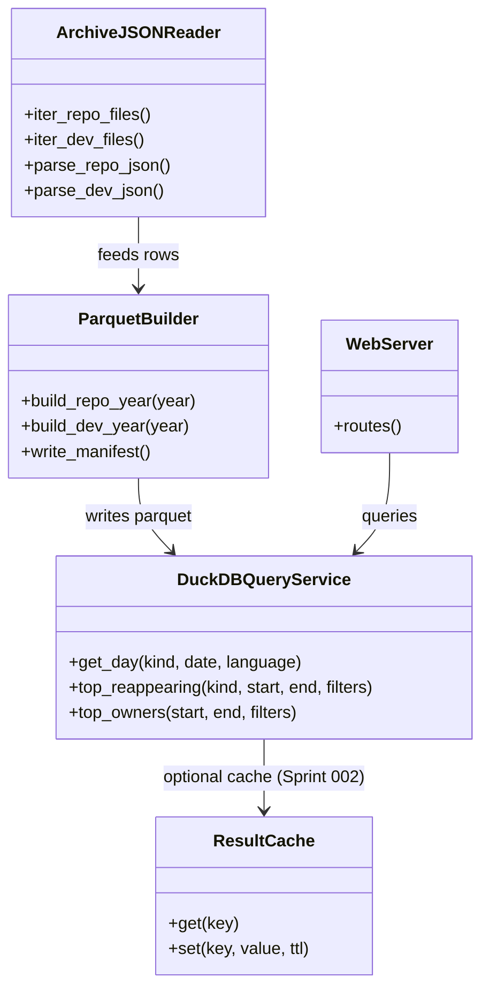
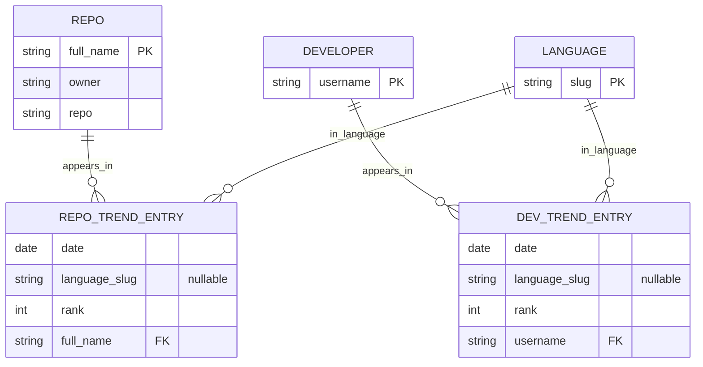
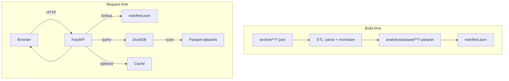

Legend: [ ] Incomplete, [X] Complete

_Evidence rule:_ When executing this plan, every completed checklist item must include:
1) the exact verification command (wrapped with backticks),
2) its exit code, and
3) any artifacts (logs, screenshots, `.scratch` transcripts) stored under `.scratch/verification/SPRINT-001/...`.

# Sprint #001-003 - GitHub Trending Archive Analytics Webserver (DuckDB/Parquet -> Cache -> Rollups)

## Objective
Deliver a local-first Python webserver + UI that makes it instant to flip between daily GitHub Trending snapshots and to compute dynamic toplists across arbitrary date ranges (global and filtered by language, repo owner/author, etc.).

This plan intentionally stages the work:
- **Sprint 001 (Approach 2):** Parquet partitions + DuckDB analytics (baseline correctness + query ergonomics)
- **Sprint 002 (Approach 4):** Result caching + pre-warming (baseline UX latency)
- **Sprint 003 (Approach 3):** Materialized aggregates / rollups for the most-common metrics (baseline scalability)

At the end of Sprint 003 we note when **Approach 1 (Star-schema SQL, e.g. SQLite/Postgres)** becomes the best follow-up.

## Success Criteria (Definition of Done)
Sprint 001 (DuckDB/Parquet):
- Build step produces Parquet + manifest from `archive/` and queries match expected semantics in tests.
- Web UI can flip dates and change languages without a full page reload (or with minimal reload if we choose server-side rendering first).
- API supports at least one “range toplist” (`top/reappearing`) with both `presence=day` and `presence=occurrence`.

Sprint 002 (Cache):
- Cached day views are measurably faster (add a regression guardrail test).
- Pre-warm makes “next/prev day” feel instant after the first load.

Sprint 003 (Rollups):
- The most common metrics avoid full raw-table scans by using rollups (with correctness tests proving parity).

## Performance Budget (initial targets; calibrate after first baseline)
- Day view (uncached): < 300ms on local machine (data already built)
- Day view (cached): < 50ms on local machine
- `top/reappearing` over 90 days: < 750ms on local machine

## Context & Problem
Today the archive lives as many tiny JSON files, optimized for storage and scraping, not analytics:
- `archive/repository/<year>/<date>/<language>.json` contains `list: ["owner/repo", ...]`
- `archive/developer/<year>/<date>/<language>.json` contains `list: ["username", ...]`

The dataset is small in bytes but large in file count, so naive “read JSON on every request” approaches become I/O-bound quickly, especially for range queries (e.g., “most frequently re-appearing repos between 2024-01-01 and 2024-03-31”).

We want:
- Fast day navigation (prev/next, jump-to-date)
- Fast dynamic analytics (group-by, distinct-days, streaks, filters)
- A data model that is explicit about semantics (per-day vs per-(day,language) appearances, and how to treat “all languages” `(null).json`)

## Open Questions (answer early in Sprint 001)
- Default `include_all_languages` behavior for range endpoints (recommend default `false` to avoid accidental double-counting).
- For “re-appearing” metrics, do we want to rank by:
  - `days_present` only, or
  - tie-break by `best_rank` / `avg_rank` / recency?
- Should the UI show repo entries from `(null).json` by default when present, even if a language filter is selected?

## Current State Snapshot (repo review)
- Scraper writes JSON in `src/main.ts` into `archive/*/<year>/<date>/*.json` with:
  - `date: "YYYY-MM-DD"`
  - `language: null | "<slug>"` (null means “All languages” and is stored in `(null).json`)
  - `list: string[]` (repo full_name or developer username)
- GitHub Actions runs hourly but commits only once per day (directory-exists guardrail) in `.github/workflows/*.yml`.

## Architecture (target)

### High-level components
- **ETL (build step):** Convert archive JSON -> canonical row format -> Parquet dataset
- **Analytics engine:** DuckDB embedded (in-process) reading Parquet
- **Web server:** FastAPI (HTTP API + minimal HTML UI)
- **Cache layer (Sprint 002):** in-memory LRU + optional disk-backed cache
- **Rollup builder (Sprint 003):** incremental materialization of high-value aggregates

### Proposed local directory layout
Keep generated artifacts out of `archive/` and clearly separate from source:
- `analytics/parquet/` - canonical row datasets (read-mostly)
- `analytics/rollups/` - derived aggregates (read-mostly)
- `analytics/duckdb/analytics.duckdb` - optional persisted DuckDB catalog (views + metadata)
- `.scratch/verification/SPRINT-001/` - evidence artifacts while implementing

### Execution guardrails (learned from a “good” sprint plan)
- Keep the work in-order (Sprint 001 -> 002 -> 003). Do not start caching/rollups until baseline semantics are proven by tests.
- Every endpoint must have at least one test (unit or integration) that asserts:
  - stable ordering (rank)
  - correct “presence” semantics (distinct-day vs occurrence)
  - correct `(null)`/all-languages behavior
- Prefer “small, explicit helpers” over clever one-off SQL strings scattered in route handlers.
- Ensure generated artifacts are ignored by git (`analytics/`, `.scratch/`, `.venv/`, `__pycache__/`).

## Data Model (canonical rows)

### Canonical tables (logical)
We keep **two** core entry tables to avoid ambiguity between repo and developer shapes:

1) `repo_trend_entry`
- `date` (DATE)
- `language` (VARCHAR, nullable; NULL => “all languages”)
- `rank` (INTEGER, 1-based position inside that file’s list)
- `full_name` (VARCHAR; `"owner/repo"`)
- `owner` (VARCHAR)
- `repo` (VARCHAR)

2) `dev_trend_entry`
- `date` (DATE)
- `language` (VARCHAR, nullable; NULL => “all languages”)
- `rank` (INTEGER, 1-based)
- `username` (VARCHAR)

### Semantics (MUST be explicit in code + docs)
- **Appearance unit options**
  - `occurrence`: a row in `*_trend_entry` (counts per (date, language) file)
  - `day_presence`: distinct `date` for an entity (dedupes across languages per day)
- **“All languages”**
  - Default UI shows “all languages” view if present for that kind+date.
  - Analytics endpoints must allow `include_all_languages={true|false}` because mixing “all languages” with per-language lists can double-count.

## API + UX (baseline)

### UI (minimal but fast)
- `/repositories` and `/developers` pages
- Day navigation: Prev/Next buttons + date picker
- Language picker: `All` + list of languages present for that day/kind
- Metrics panel: a few dynamic toplists backed by the API

### HTTP API (v1)
- `GET /api/v1/dates?kind={repository|developer}` -> available dates (sorted)
- `GET /api/v1/day?kind=repository&date=YYYY-MM-DD&language=<slug|__all__>` -> ranked list + metadata
- `GET /api/v1/top/reappearing?kind=repository&start=YYYY-MM-DD&end=YYYY-MM-DD&language=<optional>&presence={day|occurrence}&include_all_languages={true|false}`
- `GET /api/v1/top/owners?start=...&end=...` (repository only)
- `GET /api/v1/top/languages?start=...&end=...` (counts of entries per language; both kinds)

## Sprint 001 (Approach 2) - Parquet + DuckDB baseline

Execution order: 001A -> 001B -> 001C -> 001D -> 001E.

### 001A - Python project scaffold (FastAPI + DuckDB + Parquet)
- [ ] Add `pyproject.toml` (or `requirements.txt` if preferred) for:
  - runtime: `fastapi`, `uvicorn`, `duckdb`, `pyarrow`, `jinja2`
  - test: `pytest`, `httpx`
- [ ] Add module layout (example):
  - `py/gh_trending_web/` (server)
  - `py/gh_trending_analytics/` (ETL + query layer)
  - `py/tests/` (pytest)
- [ ] Add `Makefile` or scripts:
  - `make py-test`
  - `make py-run` (starts server)
  - `make analytics-build` (build parquet from archive)
- [ ] Update `.gitignore` to exclude:
  - `analytics/`
  - `.scratch/`
  - `.venv/`
  - `**/__pycache__/`

Verification:
- `python3 -m pytest -q` (exit 0)
- `python3 -c "import duckdb, pyarrow, fastapi"` (exit 0)

### 001B - ETL: archive JSON -> canonical Parquet datasets
- [ ] Implement `analytics-build` to (re)build Parquet from `archive/`:
  - Read `archive/repository/**/<language>.json` and emit `repo_trend_entry` rows
  - Read `archive/developer/**/<language>.json` and emit `dev_trend_entry` rows
  - Validate/normalize:
    - `language` can be NULL (from `(null).json`)
    - `rank` is 1..N
    - For repos, split `full_name` into `owner` and `repo` (safe handling if malformed)
  - Write Parquet in a layout optimized for “flip day” + range scans:
    - Recommended: **one parquet file per kind per year** (small dataset, low file count)
      - `analytics/parquet/repository/year=2025/repo_trend_entry.parquet`
      - `analytics/parquet/developer/year=2025/dev_trend_entry.parquet`
    - Ensure stable schema and append-friendly pipeline
    - Write rows in `date, language, rank` order to improve locality for typical queries
- [ ] Support incremental rebuild (at least by year):
  - If a given `year=YYYY` Parquet exists, allow `--rebuild-year` vs append-only mode
  - (Optional) detect missing dates by comparing `archive/**/<date>/` to manifest dates
- [ ] Emit a `analytics/parquet/manifest.json`:
  - min/max date per kind
  - available languages (global list) per kind
  - available dates (sorted) per kind
  - optional: languages-per-date map (to drive UI dropdown without scanning Parquet at request time)
  - row counts per year file

Verification:
- `python3 -m gh_trending_analytics build --help` (exit 0)
- `python3 -m gh_trending_analytics build --kind repository --year 2025` (exit 0; parquet + manifest updated)
- `python3 -m gh_trending_analytics build --kind developer --year 2025` (exit 0; parquet + manifest updated)

### 001C - DuckDB query layer (parameterized SQL)
- [ ] Implement a small query library that:
  - Opens DuckDB in-process
  - Reads the Parquet datasets via `read_parquet(...)`
  - Exposes functions for:
    - `list_dates(kind)` (from manifest, not from scanning parquet)
    - `get_day(kind, date, language)`
    - `top_reappearing(kind, start, end, language?, presence_mode, include_all_languages)`
    - `top_owners(start, end, ...)` (repo only)
  - Uses only parameterized queries (no string interpolation of user inputs)
- [ ] Concurrency decision (document + test):
  - Preferred: open a DuckDB connection per request (read-only workload) OR keep one shared connection behind a lock.
  - Avoid sharing one connection concurrently across threads without protection.
- [ ] Define precise SQL semantics for `presence=day`:
  - For repository:
    - `COUNT(DISTINCT date)` grouped by `full_name`
  - For developer:
    - `COUNT(DISTINCT date)` grouped by `username`
- [ ] Write the “load-bearing” SQL in one place (examples):
  - `top/reappearing` (repositories, presence=day)
    ```sql
    SELECT
      full_name,
      owner,
      COUNT(DISTINCT date) AS days_present,
      MIN(rank) AS best_rank
    FROM repo_trend_entry
    WHERE date BETWEEN ? AND ?
      AND (? IS NULL OR language = ?)
      AND (? OR language IS NOT NULL) -- include_all_languages=false excludes NULL language rows
    GROUP BY full_name, owner
    ORDER BY days_present DESC, best_rank ASC, full_name ASC
    LIMIT ?;
    ```
  - `get_day` (repositories)
    ```sql
    SELECT full_name, owner, repo, rank
    FROM repo_trend_entry
    WHERE date = ?
      AND (language = ? OR (language IS NULL AND ? = '__all__'))
    ORDER BY rank ASC;
    ```
- [ ] Add unit tests with a tiny synthetic archive fixture:
  - at least 2 dates, 2 languages, include `(null).json`, and one entity that appears in multiple languages on the same day
  - tests must prove the difference between `presence=occurrence` and `presence=day`

Verification:
- `python3 -m pytest -q` (exit 0)

### 001D - FastAPI server + minimal UI (day flip + analytics)
- [ ] Implement FastAPI app:
  - `GET /repositories` and `GET /developers` render HTML (Jinja2 templates)
  - `GET /api/v1/...` returns JSON
  - Server reads from `analytics/parquet/` and `manifest.json`
- [ ] Validate request params early (400 with helpful message):
  - `kind` must be one of `{repository, developer}`
  - `date` must exist in manifest for that kind
  - `language` must be either `__all__` or exist for that kind/date (depending on manifest richness)
- [ ] UI “flip day” requirements:
  - Prev/Next day navigation works even if there are missing days (skip to nearest available)
  - Language dropdown is based on available languages for that day (or global list if we keep it simple in Sprint 001)
- [ ] Add an initial metrics panel:
  - “Top re-appearing repos (distinct days)” over a chosen date range
  - “Top owners by re-appearing repos” over a chosen date range

Verification:
- `python3 -m gh_trending_web --help` (exit 0)
- `python3 -m gh_trending_web --archive ./archive --analytics ./analytics --port 8000` (exit 0; server starts)
- `curl -sf http://127.0.0.1:8000/api/v1/dates?kind=repository | head` (exit 0)

### 001E - E2E smoke tests (proof the whole stack works)
- [ ] Add a `scripts/e2e_smoke.sh` (or pytest e2e) that:
  - builds parquet from a tiny fixture
  - starts the server on an ephemeral port
  - verifies:
    - day endpoint returns stable ordering (rank)
    - top_reappearing returns expected counts
    - language filtering does not crash on `c++` / `c#` / `(null)`

Verification:
- `bash scripts/e2e_smoke.sh` (exit 0)

## Sprint 002 (Approach 4) - Result caching + pre-warming

Execution order: 002A -> 002B -> 002C.

### 002A - Cache primitives + cache keys
- [ ] Add caching for:
  - day payloads `(kind, date, language)`
  - toplists `(kind, metric, start, end, filters...)`
- [ ] Define stable cache keys (JSON-serialized params, sorted keys)
- [ ] Add TTL defaults and max-size bounds

Verification:
- `python3 -m pytest -q` (exit 0; includes cache behavior tests)

### 002B - Pre-warm strategy for fast day flipping
- [ ] When serving a day view, enqueue pre-warm for:
  - previous available date
  - next available date
  - (optional) “all languages” + currently selected language
- [ ] Add simple instrumentation (log + counters) for:
  - cache hit ratio
  - pre-warm success/failure

Verification:
- `python3 -m pytest -q` (exit 0)

### 002C - Performance budget + regression guardrails
- [ ] Add a lightweight perf test that asserts:
  - cached day view endpoint responds under a target threshold on local machine
  - top_reappearing over 30/90 days stays within a reasonable bound

Verification:
- `python3 -m pytest -q` (exit 0)

## Sprint 003 (Approach 3) - Materialized aggregates / rollups

Execution order: 003A -> 003B -> 003C.

### 003A - Identify the “top 5” expensive queries + decide rollups
- [ ] Capture real usage patterns (or assume likely ones):
  - re-appearing repos over 7/30/90-day windows
  - longest streaks over a window
  - per-language leaders over a window
  - top owners by distinct repos over a window
- [ ] Decide rollups that preserve semantics and reduce scan cost:
  - `repo_day_presence(date, full_name, owner, best_rank, languages_count, in_all_languages)`
  - `dev_day_presence(date, username, best_rank, languages_count, in_all_languages)`

Verification:
- `python3 -m pytest -q` (exit 0; includes rollup semantics tests)

### 003B - Incremental rollup builder + storage format
- [ ] Implement `analytics-rollup` command that:
  - builds rollups from Parquet
  - supports incremental rebuild “from date X”
  - writes rollups as Parquet into `analytics/rollups/`
- [ ] Update query layer to use rollups when the query can be answered from them
  - (must be correctness-preserving; fall back to raw tables if unsure)

Verification:
- `python3 -m gh_trending_analytics rollup --help` (exit 0)
- `python3 -m pytest -q` (exit 0)

### 003C - Extend analytics endpoints (streaks + advanced toplists)
- [ ] Add endpoints:
  - `GET /api/v1/top/streaks?kind=repository&start=...&end=...&language=...`
  - `GET /api/v1/top/newcomers?kind=repository&start=...&end=...` (first_seen within window)
- [ ] Add tests for streak calculations (edge cases: gaps, duplicates across languages, include/exclude all-languages)

Verification:
- `bash scripts/e2e_smoke.sh` (exit 0)

### Note (post-003 follow-up): When to consider Approach 1 (Star-schema SQL)
If any of the following becomes true, consider migrating the analytics store to SQLite/Postgres (or generating a SQLite file for distribution):
- You need multiple concurrent users over a network (DuckDB embedded concurrency becomes limiting)
- You need richer indexing and point-lookups over huge history (beyond “scan + group”)
- You want to publish this as a hosted service with auth, rate limiting, and heavy traffic

In that follow-up, keep the Parquet datasets as the immutable “source of truth” and build a SQL warehouse as a derived artifact.

## Risks & Mitigations
- Many tiny JSON inputs: ETL must be incremental and should not `glob` the entire tree on every request.
- Double counting across `(null)` and per-language lists: must make `include_all_languages` explicit and tested.
- Special characters in language slugs and filenames (`c++`, `c#`): ensure URL encoding/decoding is correct end-to-end.
- “Developers” data begins later than repositories: UI must handle missing kinds/dates gracefully.

## Non-goals (for these sprints)
- No GitHub API enrichment (stars, descriptions, topics) - can be added later.
- No user accounts/auth.
- No attempt to replicate GitHub Trending ranking logic beyond archived ordering.

## Appendix - Diagrams

### Domain model (class diagram)


### E-R diagram (logical)


### Dataflow (ETL + request path)

