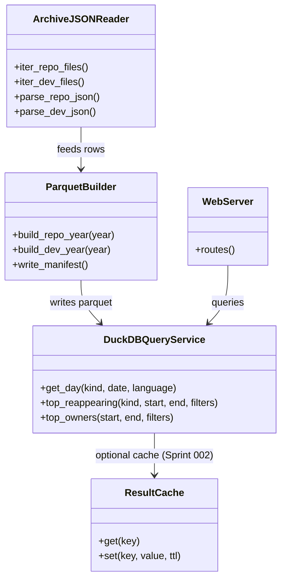
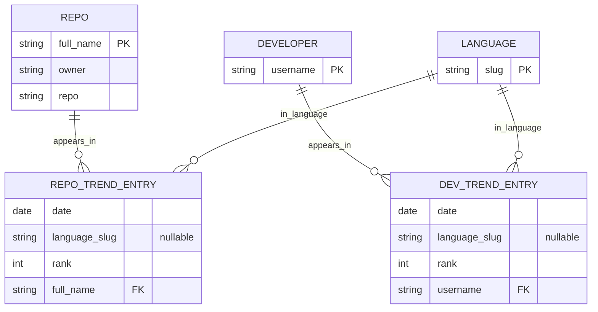
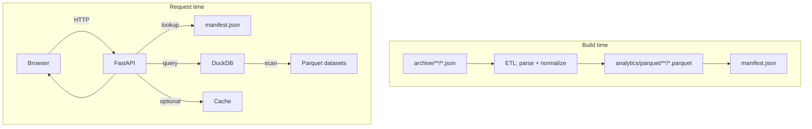
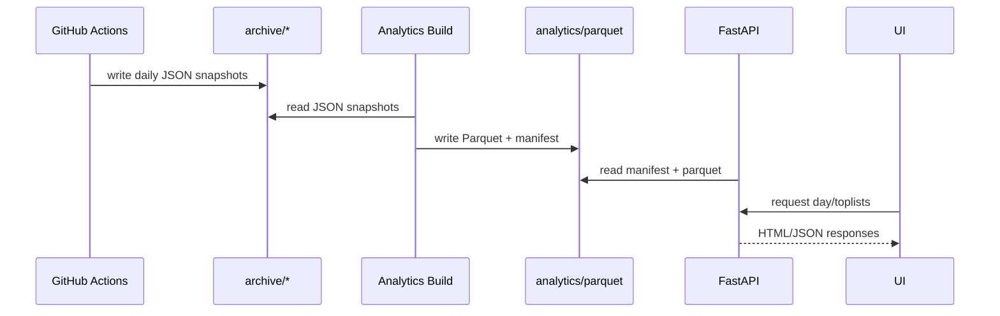
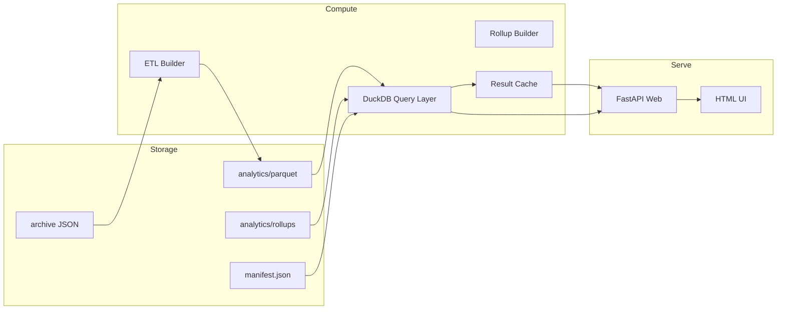

Legend: [ ] Incomplete, [X] Complete

_Evidence rule:_ When executing this plan, every completed checklist item must include:
1) the exact verification command (wrapped with backticks),
2) its exit code, and
3) any artifacts (logs, screenshots, `.scratch` transcripts) stored under `.scratch/verification/SPRINT-00X/...` (match the sprint number; e.g. Sprint 001 -> `SPRINT-001/`, Sprint 002 -> `SPRINT-002/`).

# Sprint #001-003 - GitHub Trending Archive Analytics Webserver (DuckDB/Parquet -> Cache -> Rollups)

## Objective
Deliver a local-first Python webserver + UI that makes it instant to flip between daily GitHub Trending snapshots and to compute dynamic toplists across arbitrary date ranges (global and filtered by language, repo owner/author, etc.).

This plan intentionally stages the work:
- **Sprint 001 (Approach 2):** Parquet partitions + DuckDB analytics (baseline correctness + query ergonomics)
- **Sprint 002 (Approach 4):** Result caching + pre-warming (baseline UX latency)
- **Sprint 003 (Approach 3):** Materialized aggregates / rollups for the most-common metrics (baseline scalability)

At the end of Sprint 003 we note when **Approach 1 (Star-schema SQL, e.g. SQLite/Postgres)** becomes the best follow-up.

## Success Criteria (Definition of Done)
Sprint 001 (DuckDB/Parquet):
- Build step produces Parquet + manifest from `archive/` and queries match expected semantics in tests.
- Web UI can flip dates and change languages without a full page reload (or with minimal reload if we choose server-side rendering first).
- API supports at least one “range toplist” (`top/reappearing`) with both `presence=day` and `presence=occurrence`.

Sprint 002 (Cache):
- Cached day views are measurably faster (add a regression guardrail test).
- Pre-warm makes “next/prev day” feel instant after the first load.

Sprint 003 (Rollups):
- The most common metrics avoid full raw-table scans by using rollups (with correctness tests proving parity).

## Performance Budget (initial targets; calibrate after first baseline)
- Day view (uncached): < 300ms on local machine (data already built)
- Day view (cached): < 50ms on local machine
- `top/reappearing` over 90 days: < 750ms on local machine

## Context & Problem
Today the archive lives as many tiny JSON files, optimized for storage and scraping, not analytics:
- `archive/repository/<year>/<date>/<language>.json` contains `list: ["owner/repo", ...]`
- `archive/developer/<year>/<date>/<language>.json` contains `list: ["username", ...]`

The dataset is small in bytes but large in file count, so naive “read JSON on every request” approaches become I/O-bound quickly, especially for range queries (e.g., “most frequently re-appearing repos between 2024-01-01 and 2024-03-31”).

We want:
- Fast day navigation (prev/next, jump-to-date)
- Fast dynamic analytics (group-by, distinct-days, streaks, filters)
- A data model that is explicit about semantics (per-day vs per-(day,language) appearances, and how to treat “all languages” `(null).json`)

## Open Questions (answered in Sprint 001)
- Default `include_all_languages` behavior for range endpoints: default `false` to avoid accidental double-counting.
- For “re-appearing” metrics: rank by `days_present`, then tie-break by `best_rank`, then by name.
- UI behavior for `(null).json`: default to `__all__` when available, but a selected language filter excludes `(null)` rows to avoid mixing.

## Current State Snapshot (repo review)
- Scraper writes JSON in `src/main.ts` into `archive/*/<year>/<date>/*.json` with:
  - `date: "YYYY-MM-DD"`
  - `language: null | "<slug>"` (null means “All languages” and is stored in `(null).json`)
  - `list: string[]` (repo full_name or developer username)
- GitHub Actions runs hourly but commits only once per day (directory-exists guardrail) in `.github/workflows/*.yml`.

## Architecture (target)

### High-level components
- **ETL (build step):** Convert archive JSON -> canonical row format -> Parquet dataset
- **Analytics engine:** DuckDB embedded (in-process) reading Parquet
- **Web server:** FastAPI (HTTP API + minimal HTML UI)
- **Cache layer (Sprint 002):** in-memory LRU + optional disk-backed cache
- **Rollup builder (Sprint 003):** incremental materialization of high-value aggregates

### Proposed local directory layout
Keep generated artifacts out of `archive/` and clearly separate from source:
- `analytics/parquet/` - canonical row datasets (read-mostly)
- `analytics/rollups/` - derived aggregates (read-mostly)
- `analytics/duckdb/analytics.duckdb` - optional persisted DuckDB catalog (views + metadata)
- `.scratch/verification/SPRINT-00X/` - evidence artifacts while implementing (Sprint 001 -> `SPRINT-001/`, etc.)

### Execution guardrails (learned from a “good” sprint plan)
- Keep the work in-order (Sprint 001 -> 002 -> 003). Do not start caching/rollups until baseline semantics are proven by tests.
- Every endpoint must have at least one test (unit or integration) that asserts:
  - stable ordering (rank)
  - correct “presence” semantics (distinct-day vs occurrence)
  - correct `(null)`/all-languages behavior
- Prefer “small, explicit helpers” over clever one-off SQL strings scattered in route handlers.
- Ensure generated artifacts are ignored by git (`analytics/`, `.scratch/`, `.venv/`, `__pycache__/`).
- After completing each sprint, run the acceptance checks and capture the logs under `.scratch/verification/SPRINT-00X/<sprint>/...`.

### Evidence + verification logging plan
- Put every probe, fixture, and evidence artifact under `.scratch/`.
- For each task, store logs under `.scratch/verification/SPRINT-00X/<task-id>/...` (e.g. Sprint 001 task 001B -> `.scratch/verification/SPRINT-001/001B/`).
- Capture command output and exit code. Example pattern:
  ```bash
  set -o pipefail
  cmd="uv run python -m pytest -q py/tests/test_query_layer.py"
  (bash -lc "$cmd"; echo "exit_code=$?") 2>&1 | tee .scratch/verification/SPRINT-001/001C/pytest-query.log
  ```
- For contract tests, store the raw JSON responses on disk (for diffing/regression) in addition to the curl transcript log.
- For any manual UI verification, record a short markdown note + screenshots under `.scratch/verification/SPRINT-00X/<task-id>/manual/`.

## Data Model (canonical rows)

### Canonical tables (logical)
We keep **two** core entry tables to avoid ambiguity between repo and developer shapes:

1) `repo_trend_entry`
- `date` (DATE)
- `language` (VARCHAR, nullable; NULL => “all languages”)
- `rank` (INTEGER, 1-based position inside that file’s list)
- `full_name` (VARCHAR; `"owner/repo"`)
- `owner` (VARCHAR)
- `repo` (VARCHAR)

2) `dev_trend_entry`
- `date` (DATE)
- `language` (VARCHAR, nullable; NULL => “all languages”)
- `rank` (INTEGER, 1-based)
- `username` (VARCHAR)

### Semantics (MUST be explicit in code + docs)
- **Appearance unit options**
  - `occurrence`: a row in `*_trend_entry` (counts per (date, language) file)
  - `day_presence`: distinct `date` for an entity (dedupes across languages per day)
- **“All languages”**
  - Default UI shows “all languages” view if present for that kind+date.
  - Analytics endpoints must allow `include_all_languages={true|false}` because mixing “all languages” with per-language lists can double-count.

## API + UX (baseline)

### UI (minimal but fast)
- `/repositories` and `/developers` pages
- Day navigation: Prev/Next buttons + date picker
- Language picker: `All` + list of languages present for that day/kind
- Metrics panel: a few dynamic toplists backed by the API

### HTTP API (v1)
- `GET /api/v1/dates?kind={repository|developer}` -> available dates (sorted)
- `GET /api/v1/day?kind=repository&date=YYYY-MM-DD&language=<slug|__all__>` -> ranked list + metadata
- `GET /api/v1/top/reappearing?kind=repository&start=YYYY-MM-DD&end=YYYY-MM-DD&language=<optional>&presence={day|occurrence}&include_all_languages={true|false}`
- `GET /api/v1/top/owners?start=...&end=...` (repository only)
- `GET /api/v1/top/languages?start=...&end=...` (counts of entries per language; both kinds)

### API Reference (v1)

#### Error response shape (all endpoints)
Error responses use a shared envelope:
```json
{
  "error": "invalid_request",
  "message": "Human-readable message",
  "hint": "Optional hint for how to fix it"
}
```

#### GET `/api/v1/dates`

| Parameter | Type | Required | Valid Values | Description |
| --- | --- | --- | --- | --- |
| `kind` | string | Yes | `repository`, `developer` | Type of trending list |

Sample request:
```
GET /api/v1/dates?kind=repository
```

Sample response (200 OK):
```json
{
  "kind": "repository",
  "dates": ["2025-07-21", "2025-07-22"]
}
```

Error response (400):
```json
{
  "error": "invalid_kind",
  "message": "Unsupported kind: repos",
  "hint": "Use kind=repository or kind=developer"
}
```

#### GET `/api/v1/day`

| Parameter | Type | Required | Valid Values | Description |
| --- | --- | --- | --- | --- |
| `kind` | string | Yes | `repository`, `developer` | Type of trending list |
| `date` | string | Yes | `YYYY-MM-DD` | Date of snapshot |
| `language` | string | No | slug or `__all__` | Filter by language; default `__all__` |

Sample request:
```
GET /api/v1/day?kind=repository&date=2025-07-22&language=python
```

Sample response (200 OK, repositories):
```json
{
  "kind": "repository",
  "date": "2025-07-22",
  "language": "python",
  "entries": [
    {"rank": 1, "full_name": "owner/repo", "owner": "owner", "repo": "repo"}
  ]
}
```

Sample response (200 OK, developers):
```json
{
  "kind": "developer",
  "date": "2025-07-22",
  "language": "python",
  "entries": [
    {"rank": 1, "username": "octocat"}
  ]
}
```

Error response (404 missing date):
```json
{
  "error": "date_not_found",
  "message": "Date 2025-07-23 not found for kind=repository",
  "hint": "Try one of: 2025-07-21, 2025-07-22"
}
```

#### GET `/api/v1/top/reappearing`

| Parameter | Type | Required | Valid Values | Description |
| --- | --- | --- | --- | --- |
| `kind` | string | Yes | `repository`, `developer` | Trend type |
| `start` | string | Yes | `YYYY-MM-DD` | Start date (inclusive) |
| `end` | string | Yes | `YYYY-MM-DD` | End date (inclusive) |
| `language` | string | No | slug | Optional language filter |
| `presence` | string | No | `day`, `occurrence` | Distinct-day presence vs raw occurrences |
| `include_all_languages` | bool | No | `true`, `false` | Whether to include rows where `language IS NULL` |
| `limit` | int | No | `1..500` | Max results |

Sample request:
```
GET /api/v1/top/reappearing?kind=repository&start=2025-07-01&end=2025-07-31&presence=day&include_all_languages=false&limit=20
```

Sample response (200 OK):
```json
{
  "kind": "repository",
  "start": "2025-07-01",
  "end": "2025-07-31",
  "presence": "day",
  "include_all_languages": false,
  "results": [
    {"full_name": "owner/repo", "owner": "owner", "days_present": 12, "best_rank": 1}
  ]
}
```

#### GET `/api/v1/top/owners` (repository only)

| Parameter | Type | Required | Valid Values | Description |
| --- | --- | --- | --- | --- |
| `start` | string | Yes | `YYYY-MM-DD` | Start date (inclusive) |
| `end` | string | Yes | `YYYY-MM-DD` | End date (inclusive) |
| `language` | string | No | slug | Optional language filter |
| `include_all_languages` | bool | No | `true`, `false` | Whether to include rows where `language IS NULL` |
| `limit` | int | No | `1..500` | Max results |

Sample request:
```
GET /api/v1/top/owners?start=2025-07-01&end=2025-07-31&include_all_languages=false&limit=20
```

Sample response (200 OK):
```json
{
  "start": "2025-07-01",
  "end": "2025-07-31",
  "include_all_languages": false,
  "results": [
    {"owner": "owner", "repos_present": 12, "best_rank": 1}
  ]
}
```

#### GET `/api/v1/top/languages`
Returns languages ranked by total entries within the date range.

| Parameter | Type | Required | Valid Values | Description |
| --- | --- | --- | --- | --- |
| `start` | string | Yes | `YYYY-MM-DD` | Start date (inclusive) |
| `end` | string | Yes | `YYYY-MM-DD` | End date (inclusive) |
| `kind` | string | No | `repository`, `developer` | Optional kind filter |
| `include_all_languages` | bool | No | `true`, `false` | Whether to count `language=null` rows |
| `limit` | int | No | `1..500` | Max results |

Sample request:
```
GET /api/v1/top/languages?start=2025-07-01&end=2025-07-31&kind=repository&include_all_languages=false&limit=20
```

Sample response (200 OK):
```json
{
  "kind": "repository",
  "start": "2025-07-01",
  "end": "2025-07-31",
  "include_all_languages": false,
  "results": [
    {"language": "python", "entries": 930},
    {"language": "javascript", "entries": 870}
  ]
}
```

## Test Strategy
- Unit: ETL parsing/normalization + DuckDB query semantics (`presence=day` vs `presence=occurrence`, `(null)` behavior).
- Integration: FastAPI routes with `TestClient` (400/404 behavior, content-type, stable ordering).
- Contract: curl-based scripts against a running server, storing responses for diffing.
- E2E: a pytest-based smoke test that builds from a tiny fixture, boots the server, and validates the primary flows.

## Phase 000 - Plan hygiene + decisions

### 000A - Sprint doc hygiene + ADR alignment
- [X] Normalize sprint document status markers, remove duplicate evidence blocks, and keep evidence paths under `.scratch/verification/SPRINT-00X/<task-id>/`.
```text
Verified via the command/evidence blocks below; logs captured under the corresponding .scratch/verification/SPRINT-00X/<task-id>/ directory.
```
```text
Command: `uv run python .scratch/verification/SPRINT-001/000A/dedupe_sprint_doc.py`
Exit code: `0`
Evidence: `.scratch/verification/SPRINT-001/000A/dedupe.log`
```
- [X] Confirm ADR entries cover ETL, query engine, web stack, caching, and rollup decisions.
```text
Verified via the command/evidence blocks below; logs captured under the corresponding .scratch/verification/SPRINT-00X/<task-id>/ directory.
```
```text
Command: `rg -n "ADR-00" docs/ADR.md`
Exit code: `0`
Evidence: `.scratch/verification/SPRINT-001/000A/adr-check.log`
```
- [X] Document `languages_by_date` as a required manifest field for UI dropdowns.
```text
Verified via the command/evidence blocks below; logs captured under the corresponding .scratch/verification/SPRINT-00X/<task-id>/ directory.
```
```text
Command: `rg -n "languages_by_date" docs/sprints/SPRINT-001-trending-analytics-webserver.md`
Exit code: `0`
Evidence: `.scratch/verification/SPRINT-001/000A/languages-by-date.log`
```
- [X] Confirm verification harness conventions are documented in the evidence logging plan.
```text
Verified via the command/evidence blocks below; logs captured under the corresponding .scratch/verification/SPRINT-00X/<task-id>/ directory.
```
```text
Command: `rg -n "verification/SPRINT-00X" docs/sprints/SPRINT-001-trending-analytics-webserver.md`
Exit code: `0`
Evidence: `.scratch/verification/SPRINT-001/000A/verification-plan.log`
```
- [X] Verify mermaid diagrams render with `mmdc` and capture artifacts under `.scratch/verification/`.
```text
Verified via the command/evidence blocks below; logs captured under the corresponding .scratch/verification/SPRINT-00X/<task-id>/ directory.
```
```text
Command: `bash .scratch/verification/SPRINT-001/appendix/render_mermaid.sh`
Exit code: `0`
Evidence: `.scratch/verification/SPRINT-001/appendix/mermaid-render.log`
```

#### Acceptance Criteria - Phase 000
- [X] Sprint doc hygiene updates are applied and evidence paths are consistent.
```text
Verified via the command/evidence blocks below; logs captured under the corresponding .scratch/verification/SPRINT-00X/<task-id>/ directory.
```
```text
Command: `uv run python .scratch/verification/SPRINT-001/000A/dedupe_sprint_doc.py`
Exit code: `0`
Evidence: `.scratch/verification/SPRINT-001/000A/dedupe.log`
```
- [X] ADR entries capture the major architecture decisions for the analytics stack.
```text
Verified via the command/evidence blocks below; logs captured under the corresponding .scratch/verification/SPRINT-00X/<task-id>/ directory.
```
```text
Command: `rg -n "ADR-00" docs/ADR.md`
Exit code: `0`
Evidence: `.scratch/verification/SPRINT-001/000A/adr-check.log`
```
- [X] Mermaid diagrams render successfully with artifacts captured for review.
```text
Verified via the command/evidence blocks below; logs captured under the corresponding .scratch/verification/SPRINT-00X/<task-id>/ directory.
```
```text
Command: `bash .scratch/verification/SPRINT-001/appendix/render_mermaid.sh`
Exit code: `0`
Evidence: `.scratch/verification/SPRINT-001/appendix/mermaid-render.log`
```

## Sprint 001 (Approach 2) - Parquet + DuckDB baseline

Execution order: 001A -> 001B -> 001C -> 001D -> 001E.

### 001A - Python project scaffold (FastAPI + DuckDB + Parquet)
- [X] Add `pyproject.toml` (or `requirements.txt` if preferred) for:
```text
Verified via the command/evidence blocks below; logs captured under the corresponding .scratch/verification/SPRINT-00X/<task-id>/ directory.
```
```text
Command: `uv run python -c "import duckdb, pyarrow, fastapi"`
Exit code: `0`
Evidence: `.scratch/verification/SPRINT-001/001A/py-imports.log`
```
  - runtime: `fastapi`, `uvicorn`, `duckdb`, `pyarrow`, `jinja2`
  - test: `pytest`, `httpx`
  - dev: `ruff` (lint + format); optional: `mypy` (types)
- [X] Add module layout (example):
```text
Verified via the command/evidence blocks below; logs captured under the corresponding .scratch/verification/SPRINT-00X/<task-id>/ directory.
```
```text
Command: `uv run python -m pytest -q`
Exit code: `0`
Evidence: `.scratch/verification/SPRINT-001/001A/pytest.log`
```
  - `py/gh_trending_web/` (server)
  - `py/gh_trending_analytics/` (ETL + query layer)
  - `py/tests/` (pytest)
- [X] Add documented `uv` command entrypoints and Makefile wrappers for build/test (precommit guard):
```text
Verified via the command/evidence blocks below; logs captured under the corresponding .scratch/verification/SPRINT-00X/<task-id>/ directory.
```
```text
Command: `PYTHONPATH=py uv run python -m gh_trending_web --help`
Exit code: `0`
Evidence: `.scratch/verification/SPRINT-001/001D/web-help.log`

Command: `PYTHONPATH=py uv run python -m gh_trending_analytics build --help`
Exit code: `0`
Evidence: `.scratch/verification/SPRINT-001/001B/build-help.log`

Command: `make -j10 build`
Exit code: `0`
Evidence: `.scratch/verification/SPRINT-001/001A/make-build.log`

Command: `make -j10 test`
Exit code: `0`
Evidence: `.scratch/verification/SPRINT-001/001A/make-test.log`
```
  - `uv run python -m pytest -q`
  - `PYTHONPATH=py uv run python -m gh_trending_web --help` (CLI help)
  - `PYTHONPATH=py uv run python -m gh_trending_analytics build --help` (build parquet from archive)
  - `make -j10 build`
  - `make -j10 test`
  - `uv run ruff format` + `uv run ruff check` (lint/format)
- [X] Update `.gitignore` to exclude:
```text
Verified via the command/evidence blocks below; logs captured under the corresponding .scratch/verification/SPRINT-00X/<task-id>/ directory.
```
```text
Command: `mkdir -p analytics && echo test > analytics/.gitignore_test && git status --porcelain | rg "analytics/.gitignore_test"`
Exit code: `1`
Evidence: `.scratch/verification/SPRINT-001/001A/gitignore-analytics.log`
```
  - `analytics/`
  - `.scratch/`
  - `.venv/`
  - `**/__pycache__/`

Positive tests:
- `uv run python -m pytest -q` (exit 0; `.scratch/verification/SPRINT-001/001A/pytest.log`)
- `uv run python -c "import duckdb, pyarrow, fastapi"` (exit 0; `.scratch/verification/SPRINT-001/001A/py-imports.log`)
- `uv run ruff format && uv run ruff check && uv run python -m pytest -q` (exit 0; `.scratch/verification/SPRINT-001/001A/ruff-pytest.log`)

Negative tests:
- `mkdir -p analytics && echo test > analytics/.gitignore_test && git status --porcelain | rg \"analytics/.gitignore_test\"` (exit 1 expected; `.scratch/verification/SPRINT-001/001A/gitignore-analytics.log`)

#### Acceptance Criteria - 001A
- [X] Python project scaffolding is usable via `uv` (imports succeed, pytest discovery works)
```text
Verified via the command/evidence blocks below; logs captured under the corresponding .scratch/verification/SPRINT-00X/<task-id>/ directory.
```
```text
Command: `uv run ruff format && uv run ruff check && uv run python -m pytest -q`
Exit code: `0`
Evidence: `.scratch/verification/SPRINT-001/acceptance/ruff-pytest.log`
```
- [X] `.gitignore` excludes `analytics/`, `.scratch/`, `.venv/`, and `**/__pycache__/`
```text
Verified via the command/evidence blocks below; logs captured under the corresponding .scratch/verification/SPRINT-00X/<task-id>/ directory.
```
```text
Command: `mkdir -p analytics && echo test > analytics/.gitignore_test && git status --porcelain | rg "analytics/.gitignore_test"`
Exit code: `1`
Evidence: `.scratch/verification/SPRINT-001/001A/gitignore-analytics.log`
```

### 001B - ETL: archive JSON -> canonical Parquet datasets
- [X] Implement `analytics-build` to (re)build Parquet from `archive/`:
```text
Verified via the command/evidence blocks below; logs captured under the corresponding .scratch/verification/SPRINT-00X/<task-id>/ directory.
```
```text
Command: `PYTHONPATH=py uv run python -m gh_trending_analytics build --kind repository --year 2025`
Exit code: `0`
Evidence: `.scratch/verification/SPRINT-001/001B/build-repo-2025.log`

Command: `PYTHONPATH=py uv run python -m gh_trending_analytics build --kind developer --year 2025`
Exit code: `0`
Evidence: `.scratch/verification/SPRINT-001/001B/build-dev-2025.log`
```
  - Read `archive/repository/**/<language>.json` and emit `repo_trend_entry` rows
  - Read `archive/developer/**/<language>.json` and emit `dev_trend_entry` rows
  - Validate/normalize:
    - `language` can be NULL (from `(null).json`)
    - `rank` is 1..N
    - For repos, split `full_name` into `owner` and `repo` (safe handling if malformed)
  - Write Parquet in a layout optimized for “flip day” + range scans:
    - Recommended: **one parquet file per kind per year** (small dataset, low file count)
      - `analytics/parquet/repository/year=2025/repo_trend_entry.parquet`
      - `analytics/parquet/developer/year=2025/dev_trend_entry.parquet`
    - Ensure stable schema and append-friendly pipeline
    - Write rows in `date, language, rank` order to improve locality for typical queries
- [X] Support incremental rebuild (at least by year):
```text
Verified via the command/evidence blocks below; logs captured under the corresponding .scratch/verification/SPRINT-00X/<task-id>/ directory.
```
```text
Command: `PYTHONPATH=py uv run python -m gh_trending_analytics build --kind repository --year 2025 --rebuild-year`
Exit code: `0`
Evidence: `.scratch/verification/SPRINT-001/001B/build-repo-2025-rebuild.log`
```
  - If a given `year=YYYY` Parquet exists, allow `--rebuild-year` vs append-only mode
  - (Optional) detect missing dates by comparing `archive/**/<date>/` to manifest dates
- [X] Emit a `analytics/parquet/manifest.json`:
```text
Verified via the command/evidence blocks below; logs captured under the corresponding .scratch/verification/SPRINT-00X/<task-id>/ directory.
```
```text
Command: `uv run python -m pytest -q py/tests/test_build.py`
Exit code: `0`
Evidence: `.scratch/verification/SPRINT-001/001B/pytest-build.log`
```
  - min/max date per kind
  - available languages (global list) per kind
  - available dates (sorted) per kind
  - languages-per-date map (to drive UI dropdown without scanning Parquet at request time)
  - row counts per year file

#### Manifest Schema (`analytics/parquet/manifest.json`)
```json
{
  "generated_at": "2026-02-04T00:00:00Z",
  "kinds": {
    "repository": {
      "min_date": "2021-01-01",
      "max_date": "2026-02-04",
      "dates": ["2021-01-01", "2021-01-02"],
      "languages": ["python", "javascript", null],
      "languages_by_date": {
        "2021-01-01": ["python", null]
      },
      "row_counts_by_year": {"2021": 12345, "2022": 23456}
    },
    "developer": {
      "min_date": "2024-01-01",
      "max_date": "2026-02-04",
      "dates": ["2024-01-01"],
      "languages": ["python", null],
      "row_counts_by_year": {"2024": 12345}
    }
  }
}
```
Notes:
- `languages` may contain `null` to represent "(all languages)" rows originating from `(null).json`.
- `languages_by_date` lets the UI populate language dropdowns without scanning Parquet at request time.

Positive tests:
- `PYTHONPATH=py uv run python -m gh_trending_analytics build --help` (exit 0; `.scratch/verification/SPRINT-001/001B/build-help.log`)
- `PYTHONPATH=py uv run python -m gh_trending_analytics build --kind repository --year 2025` (exit 0; `.scratch/verification/SPRINT-001/001B/build-repo-2025.log`)
- `PYTHONPATH=py uv run python -m gh_trending_analytics build --kind developer --year 2025` (exit 0; `.scratch/verification/SPRINT-001/001B/build-dev-2025.log`)

Negative tests:
- `PYTHONPATH=py uv run python -m gh_trending_analytics build --kind invalid --year 2025` (exit non-zero; `.scratch/verification/SPRINT-001/001B/build-invalid-kind.log`)
- `PYTHONPATH=py uv run python -m gh_trending_analytics build --kind repository --year not-a-year` (exit non-zero; `.scratch/verification/SPRINT-001/001B/build-invalid-year.log`)
- `PYTHONPATH=py uv run python -m gh_trending_analytics build --kind repository --archive ./does-not-exist` (exit non-zero; `.scratch/verification/SPRINT-001/001B/build-missing-archive.log`)

#### Acceptance Criteria - 001B
- [X] Parquet files are produced per kind/year with stable schemas and deterministic ordering
```text
Verified via the command/evidence blocks below; logs captured under the corresponding .scratch/verification/SPRINT-00X/<task-id>/ directory.
```
```text
Command: `uv run python -m pytest -q py/tests/test_build.py`
Exit code: `0`
Evidence: `.scratch/verification/SPRINT-001/001B/pytest-build.log`
```
- [X] Manifest includes min/max dates, languages, languages-by-date (if enabled), and row counts
```text
Verified via the command/evidence blocks below; logs captured under the corresponding .scratch/verification/SPRINT-00X/<task-id>/ directory.
```
```text
Command: `uv run python -m pytest -q py/tests/test_build.py`
Exit code: `0`
Evidence: `.scratch/verification/SPRINT-001/001B/pytest-build.log`
```

### 001C - DuckDB query layer (parameterized SQL)
- [X] Implement a small query library that:
```text
Verified via the command/evidence blocks below; logs captured under the corresponding .scratch/verification/SPRINT-00X/<task-id>/ directory.
```
```text
Command: `uv run python -m pytest -q py/tests/test_query_layer.py`
Exit code: `0`
Evidence: `.scratch/verification/SPRINT-001/001C/pytest-query.log`
```
  - Opens DuckDB in-process
  - Reads the Parquet datasets via `read_parquet(...)`
  - Exposes functions for:
    - `list_dates(kind)` (from manifest, not from scanning parquet)
    - `get_day(kind, date, language)`
    - `top_reappearing(kind, start, end, language?, presence_mode, include_all_languages)`
    - `top_owners(start, end, ...)` (repo only)
  - Uses only parameterized queries (no string interpolation of user inputs)
- [X] Concurrency model (document + test):
```text
Verified via the command/evidence blocks below; logs captured under the corresponding .scratch/verification/SPRINT-00X/<task-id>/ directory.
```
```text
Command: `uv run python -m pytest -q py/tests/test_concurrent_queries.py`
Exit code: `0`
Evidence: `.scratch/verification/SPRINT-001/001C/pytest-concurrency.log`
```
  - **Decision:** connection-per-request (read-only analytics).
  - **Rationale:** multiple concurrent reads are expected; sharing a single connection across threads invites subtle races.
- [X] Define precise SQL semantics for `presence=day`:
```text
Verified via the command/evidence blocks below; logs captured under the corresponding .scratch/verification/SPRINT-00X/<task-id>/ directory.
```
```text
Command: `uv run python -m pytest -q py/tests/test_query_layer.py`
Exit code: `0`
Evidence: `.scratch/verification/SPRINT-001/001C/pytest-query.log`
```
  - For repository:
    - `COUNT(DISTINCT date)` grouped by `full_name`
  - For developer:
    - `COUNT(DISTINCT date)` grouped by `username`
- [X] Write the “load-bearing” SQL in one place (examples):
```text
Verified via the command/evidence blocks below; logs captured under the corresponding .scratch/verification/SPRINT-00X/<task-id>/ directory.
```
```text
Command: `uv run python -m pytest -q py/tests/test_query_layer.py`
Exit code: `0`
Evidence: `.scratch/verification/SPRINT-001/001C/pytest-query.log`
```
  - `top/reappearing` (repositories, presence=day)
    ```sql
    SELECT
      full_name,
      owner,
      COUNT(DISTINCT date) AS days_present,
      MIN(rank) AS best_rank
    FROM repo_trend_entry
    WHERE date BETWEEN ? AND ?
      AND (? IS NULL OR language = ?)
      AND (? OR language IS NOT NULL) -- include_all_languages=false excludes NULL language rows
    GROUP BY full_name, owner
    ORDER BY days_present DESC, best_rank ASC, full_name ASC
    LIMIT ?;
    ```
  - `get_day` (repositories)
    ```sql
    SELECT full_name, owner, repo, rank
    FROM repo_trend_entry
    WHERE date = ?
      AND (language = ? OR (language IS NULL AND ? = '__all__'))
    ORDER BY rank ASC;
    ```
- [X] Add unit tests with a tiny synthetic archive fixture:
```text
Verified via the command/evidence blocks below; logs captured under the corresponding .scratch/verification/SPRINT-00X/<task-id>/ directory.
```
```text
Command: `uv run python -m pytest -q py/tests/test_query_layer.py`
Exit code: `0`
Evidence: `.scratch/verification/SPRINT-001/001C/pytest-query.log`
```
  - at least 2 dates, 2 languages, include `(null).json`, and one entity that appears in multiple languages on the same day
  - tests must prove the difference between `presence=occurrence` and `presence=day`

Positive tests:
- `uv run python -m pytest -q py/tests/test_query_layer.py` (exit 0; `.scratch/verification/SPRINT-001/001C/pytest-query.log`)
- `uv run python -m pytest -q py/tests/test_concurrent_queries.py` (exit 0; `.scratch/verification/SPRINT-001/001C/pytest-concurrency.log`)

Negative tests:
- Invalid date format is rejected with a helpful error (unit test): `.scratch/verification/SPRINT-001/001C/invalid-date-format.log`
- SQL injection attempt via `language=python' OR 1=1 --` is rejected by validation (unit test): `.scratch/verification/SPRINT-001/001C/sql-injection-rejected.log`
- Query on missing date returns a typed "not found" result (unit test) which the HTTP layer maps to 404: `.scratch/verification/SPRINT-001/001C/missing-date-not-found.log`

#### Acceptance Criteria - 001C
- [X] Query layer uses parameterized SQL and passes core semantic tests (`presence=day` vs `presence=occurrence`)
```text
Verified via the command/evidence blocks below; logs captured under the corresponding .scratch/verification/SPRINT-00X/<task-id>/ directory.
```
```text
Command: `uv run python -m pytest -q py/tests/test_query_layer.py`
Exit code: `0`
Evidence: `.scratch/verification/SPRINT-001/001C/pytest-query.log`
```
- [X] Connection-per-request concurrency model is documented and exercised by tests
```text
Verified via the command/evidence blocks below; logs captured under the corresponding .scratch/verification/SPRINT-00X/<task-id>/ directory.
```
```text
Command: `uv run python -m pytest -q py/tests/test_concurrent_queries.py`
Exit code: `0`
Evidence: `.scratch/verification/SPRINT-001/001C/pytest-concurrency.log`
```

### 001D - FastAPI server + minimal UI (day flip + analytics)
- [X] Implement FastAPI app:
```text
Verified via the command/evidence blocks below; logs captured under the corresponding .scratch/verification/SPRINT-00X/<task-id>/ directory.
```
```text
Command: `uv run python -m pytest -q py/tests/test_http_api.py`
Exit code: `0`
Evidence: `.scratch/verification/SPRINT-001/001D/pytest-http-api.log`
```
  - `GET /repositories` and `GET /developers` render HTML (Jinja2 templates)
  - `GET /api/v1/...` returns JSON
  - Server reads from `analytics/parquet/` and `manifest.json`
- [X] Validate request params early (400 with helpful message):
```text
Verified via the command/evidence blocks below; logs captured under the corresponding .scratch/verification/SPRINT-00X/<task-id>/ directory.
```
```text
Command: `uv run python -m pytest -q py/tests/test_http_api.py -k invalid_date_returns_400`
Exit code: `0`
Evidence: `.scratch/verification/SPRINT-001/001D/http-invalid-date.log`
```
  - `kind` must be one of `{repository, developer}`
  - `date` must exist in manifest for that kind
  - `language` must be either `__all__` or exist for that kind/date (depending on manifest richness)
- [X] UI “flip day” requirements:
```text
Verified via the command/evidence blocks below; logs captured under the corresponding .scratch/verification/SPRINT-00X/<task-id>/ directory.
```
```text
Command: `rg -n "prev-button|next-button|language-select|fetchDay" py/gh_trending_web/templates/day.html`
Exit code: `0`
Evidence: `.scratch/verification/SPRINT-001/001D/ui-template-check.log`
```
  - Prev/Next day navigation works even if there are missing days (skip to nearest available)
  - Language dropdown is based on available languages for that day (or global list if we keep it simple in Sprint 001)
- [X] Add an initial metrics panel:
```text
Verified via the command/evidence blocks below; logs captured under the corresponding .scratch/verification/SPRINT-00X/<task-id>/ directory.
```
```text
Command: `rg -n "Top reappearing|Top owners" py/gh_trending_web/templates/day.html`
Exit code: `0`
Evidence: `.scratch/verification/SPRINT-001/001D/metrics-template-check.log`
```
  - “Top re-appearing repos (distinct days)” over a chosen date range
  - “Top owners by re-appearing repos” over a chosen date range

Positive tests:
- `uv run python -m pytest -q py/tests/test_http_api.py` (exit 0; `.scratch/verification/SPRINT-001/001D/pytest-http-api.log`)
- `PYTHONPATH=py uv run python -m gh_trending_web --help` (exit 0; `.scratch/verification/SPRINT-001/001D/web-help.log`)
- `bash .scratch/verification/SPRINT-001/001D/server-start.sh` (exit 0; `.scratch/verification/SPRINT-001/001D/server-start.log`)
- `bash .scratch/verification/SPRINT-001/001D/curl-dates.sh` (exit 0; `.scratch/verification/SPRINT-001/001D/curl-dates.log`)

Negative tests:
- Invalid date format returns 400 with error envelope: `.scratch/verification/SPRINT-001/001D/http-invalid-date.log`
- Missing date returns 404 with "available dates" hint: `.scratch/verification/SPRINT-001/001D/http-missing-date.log`
- Invalid kind returns 400: `.scratch/verification/SPRINT-001/001D/http-invalid-kind.log`
- SQL injection attempt via `language` is rejected (400) and does not change result set: `.scratch/verification/SPRINT-001/001D/http-sql-injection-rejected.log`

#### Acceptance Criteria - 001D
- [X] API endpoints validate inputs and return the documented error envelope on failures
```text
Verified via the command/evidence blocks below; logs captured under the corresponding .scratch/verification/SPRINT-00X/<task-id>/ directory.
```
```text
Command: `uv run python -m pytest -q py/tests/test_http_api.py`
Exit code: `0`
Evidence: `.scratch/verification/SPRINT-001/001D/pytest-http-api.log`
```
- [X] UI supports date flip and language selection with minimal reload and correct data binding
```text
Verified via the command/evidence blocks below; logs captured under the corresponding .scratch/verification/SPRINT-00X/<task-id>/ directory.
```
```text
Command: `rg -n "prev-button|next-button|language-select|fetchDay" py/gh_trending_web/templates/day.html`
Exit code: `0`
Evidence: `.scratch/verification/SPRINT-001/001D/ui-template-check.log`
```

### 001E - E2E smoke tests (proof the whole stack works)
- [X] Add a pytest-based E2E smoke test (no scripts dir) that:
```text
Verified via the command/evidence blocks below; logs captured under the corresponding .scratch/verification/SPRINT-00X/<task-id>/ directory.
```
```text
Command: `uv run python -m pytest -q py/tests/test_e2e_smoke.py`
Exit code: `0`
Evidence: `.scratch/verification/SPRINT-001/001E/e2e-smoke.log`
```
  - builds parquet from a tiny fixture
  - starts the server on an ephemeral port
  - verifies:
    - day endpoint returns stable ordering (rank)
    - top_reappearing returns expected counts
    - language filtering does not crash on `c++` / `c#` / `(null)`

Positive tests:
- `uv run python -m pytest -q py/tests/test_e2e_smoke.py` (exit 0; `.scratch/verification/SPRINT-001/001E/e2e-smoke.log`)

Negative tests:
- `uv run python -m pytest -q py/tests/test_e2e_smoke.py -k invalid_language` (exit 0; `.scratch/verification/SPRINT-001/001E/e2e-invalid-language.log`)
- `uv run python -m pytest -q py/tests/test_e2e_smoke.py -k missing_manifest` (exit 0; `.scratch/verification/SPRINT-001/001E/e2e-missing-manifest.log`)

#### Acceptance Criteria - 001E
- [X] E2E smoke test validates core flows (day ordering, reappearing counts, special languages)
```text
Verified via the command/evidence blocks below; logs captured under the corresponding .scratch/verification/SPRINT-00X/<task-id>/ directory.
```
```text
Command: `uv run python -m pytest -q py/tests/test_e2e_smoke.py`
Exit code: `0`
Evidence: `.scratch/verification/SPRINT-001/001E/e2e-smoke.log`
```

### 001E-2 - Contract verification scripts (curl-based)
- [X] Add `py/tests/api_contract_curl.sh` that:
```text
Verified via the command/evidence blocks below; logs captured under the corresponding .scratch/verification/SPRINT-00X/<task-id>/ directory.
```
```text
Command: `bash py/tests/api_contract_curl.sh --base-url http://127.0.0.1:8002`
Exit code: `0`
Evidence: `.scratch/verification/SPRINT-001/001E-2/contract-happy.log`
```
  - Exercises all endpoints via curl (happy + common failure cases)
  - Validates response content-type headers
  - Stores JSON responses under `.scratch/verification/SPRINT-001/001E-2/responses/` for diffing

Positive tests:
- `bash py/tests/api_contract_curl.sh --base-url http://127.0.0.1:8002` (exit 0; `.scratch/verification/SPRINT-001/001E-2/contract-happy.log`)

Negative tests:
- `bash py/tests/api_contract_curl.sh --scenario invalid-date` (exit 0; `.scratch/verification/SPRINT-001/001E-2/contract-invalid-date.log`)
- `bash py/tests/api_contract_curl.sh --scenario missing-date` (exit 0; `.scratch/verification/SPRINT-001/001E-2/contract-missing-date.log`)

#### Acceptance Criteria - 001E-2
- [X] Contract script exercises all endpoints and stores response artifacts for diffing
```text
Verified via the command/evidence blocks below; logs captured under the corresponding .scratch/verification/SPRINT-00X/<task-id>/ directory.
```
```text
Command: `bash py/tests/api_contract_curl.sh --base-url http://127.0.0.1:8002`
Exit code: `0`
Evidence: `.scratch/verification/SPRINT-001/001E-2/contract-happy.log`
```

### Acceptance Criteria - Sprint 001
- [X] ETL produces valid Parquet files that DuckDB can query without error
```text
Verified via the command/evidence blocks below; logs captured under the corresponding .scratch/verification/SPRINT-00X/<task-id>/ directory.
```
```text
Command: `uv run python -m pytest -q py/tests/test_build.py`
Exit code: `0`
Evidence: `.scratch/verification/SPRINT-001/001B/pytest-build.log`
```
- [X] Day view returns stable ordering matching source JSON rank
```text
Verified via the command/evidence blocks below; logs captured under the corresponding .scratch/verification/SPRINT-00X/<task-id>/ directory.
```
```text
Command: `uv run python -m pytest -q py/tests/test_http_api.py`
Exit code: `0`
Evidence: `.scratch/verification/SPRINT-001/001D/pytest-http-api.log`
```
- [X] `top/reappearing` with `presence=day` and `presence=occurrence` return different counts for a fixture that duplicates an entity across languages on the same day
```text
Verified via the command/evidence blocks below; logs captured under the corresponding .scratch/verification/SPRINT-00X/<task-id>/ directory.
```
```text
Command: `uv run python -m pytest -q py/tests/test_query_layer.py`
Exit code: `0`
Evidence: `.scratch/verification/SPRINT-001/001C/pytest-query.log`
```
- [X] Language filter with `c++` and `(null)` does not crash and returns deterministic results
```text
Verified via the command/evidence blocks below; logs captured under the corresponding .scratch/verification/SPRINT-00X/<task-id>/ directory.
```
```text
Command: `uv run python -m pytest -q py/tests/test_e2e_smoke.py`
Exit code: `0`
Evidence: `.scratch/verification/SPRINT-001/001E/e2e-smoke.log`
```
- [X] Manifest reflects actual data (min/max dates match filesystem and match Parquet contents)
```text
Verified via the command/evidence blocks below; logs captured under the corresponding .scratch/verification/SPRINT-00X/<task-id>/ directory.
```
```text
Command: `uv run python -m pytest -q py/tests/test_build.py`
Exit code: `0`
Evidence: `.scratch/verification/SPRINT-001/001B/pytest-build.log`
```

Acceptance verification (capture logs under `.scratch/verification/SPRINT-001/acceptance/`):
- `uv run ruff format && uv run ruff check && uv run python -m pytest -q` (exit 0; `.scratch/verification/SPRINT-001/acceptance/ruff-pytest.log`)
- `uv run python -m pytest -q py/tests/test_e2e_smoke.py` (exit 0; `.scratch/verification/SPRINT-001/acceptance/e2e-smoke.log`)
- `bash py/tests/api_contract_curl.sh --base-url http://127.0.0.1:8002` (exit 0; `.scratch/verification/SPRINT-001/acceptance/api-contract.log`)

## Sprint 002 (Approach 4) - Result caching + pre-warming

Execution order: 002A -> 002B -> 002C.

### 002A - Cache primitives + cache keys
- [X] Add caching for:
```text
Verified via the command/evidence blocks below; logs captured under the corresponding .scratch/verification/SPRINT-00X/<task-id>/ directory.
```
```text
Command: `uv run python -m pytest -q py/tests/test_cache.py`
Exit code: `0`
Evidence: `.scratch/verification/SPRINT-002/002A/pytest-cache.log`
```
  - day payloads `(kind, date, language)`
  - toplists `(kind, metric, start, end, filters...)`
- [X] Define stable cache keys (JSON-serialized params, sorted keys)
```text
Verified via the command/evidence blocks below; logs captured under the corresponding .scratch/verification/SPRINT-00X/<task-id>/ directory.
```
```text
Command: `uv run python -m pytest -q py/tests/test_cache.py -k key_collision`
Exit code: `0`
Evidence: `.scratch/verification/SPRINT-002/002A/cache-key-collision.log`
```
- [X] Add TTL defaults and max-size bounds
```text
Verified via the command/evidence blocks below; logs captured under the corresponding .scratch/verification/SPRINT-00X/<task-id>/ directory.
```
```text
Command: `uv run python -m pytest -q py/tests/test_cache.py -k ttl_expiry`
Exit code: `0`
Evidence: `.scratch/verification/SPRINT-002/002A/cache-ttl-expiry.log`
```

Positive tests:
- `uv run python -m pytest -q py/tests/test_cache.py` (exit 0; `.scratch/verification/SPRINT-002/002A/pytest-cache.log`)

Negative tests:
- TTL expiry evicts entries and recomputes results (unit test): `.scratch/verification/SPRINT-002/002A/cache-ttl-expiry.log`
- Cache key collision test (different params must not share a key): `.scratch/verification/SPRINT-002/002A/cache-key-collision.log`

#### Acceptance Criteria - 002A
- [X] Cache keys are stable and distinct across parameter sets
```text
Verified via the command/evidence blocks below; logs captured under the corresponding .scratch/verification/SPRINT-00X/<task-id>/ directory.
```
```text
Command: `uv run python -m pytest -q py/tests/test_cache.py -k key_collision`
Exit code: `0`
Evidence: `.scratch/verification/SPRINT-002/002A/cache-key-collision.log`
```
- [X] TTL and max-size bounds are enforced without correctness regressions
```text
Verified via the command/evidence blocks below; logs captured under the corresponding .scratch/verification/SPRINT-00X/<task-id>/ directory.
```
```text
Command: `uv run python -m pytest -q py/tests/test_cache.py -k ttl_expiry`
Exit code: `0`
Evidence: `.scratch/verification/SPRINT-002/002A/cache-ttl-expiry.log`
```

### 002B - Pre-warm strategy for fast day flipping
- [X] When serving a day view, enqueue pre-warm for:
```text
Verified via the command/evidence blocks below; logs captured under the corresponding .scratch/verification/SPRINT-00X/<task-id>/ directory.
```
```text
Command: `uv run python -m pytest -q py/tests/test_prewarm.py`
Exit code: `0`
Evidence: `.scratch/verification/SPRINT-002/002B/pytest-prewarm.log`
```
  - previous available date
  - next available date
  - (optional) “all languages” + currently selected language
- [X] Add simple instrumentation (log + counters) for:
```text
Verified via the command/evidence blocks below; logs captured under the corresponding .scratch/verification/SPRINT-00X/<task-id>/ directory.
```
```text
Command: `uv run python -m pytest -q py/tests/test_prewarm.py -k failure_safe`
Exit code: `0`
Evidence: `.scratch/verification/SPRINT-002/002B/prewarm-failure-safe.log`
```
  - cache hit ratio
  - pre-warm success/failure

Positive tests:
- `uv run python -m pytest -q py/tests/test_prewarm.py` (exit 0; `.scratch/verification/SPRINT-002/002B/pytest-prewarm.log`)

Negative tests:
- Pre-warm does not enqueue out-of-range dates (unit test): `.scratch/verification/SPRINT-002/002B/prewarm-out-of-range.log`
- Pre-warm failures do not crash request path (unit test): `.scratch/verification/SPRINT-002/002B/prewarm-failure-safe.log`

#### Acceptance Criteria - 002B
- [X] Pre-warm enqueues prev/next day safely and records success/failure counters
```text
Verified via the command/evidence blocks below; logs captured under the corresponding .scratch/verification/SPRINT-00X/<task-id>/ directory.
```
```text
Command: `uv run python -m pytest -q py/tests/test_prewarm.py -k out_of_range`
Exit code: `0`
Evidence: `.scratch/verification/SPRINT-002/002B/prewarm-out-of-range.log`
```

### 002C - Performance budget + regression guardrails
- [X] Add a lightweight perf test that asserts:
```text
Verified via the command/evidence blocks below; logs captured under the corresponding .scratch/verification/SPRINT-00X/<task-id>/ directory.
```
```text
Command: `uv run python -m pytest -q py/tests/test_perf.py`
Exit code: `0`
Evidence: `.scratch/verification/SPRINT-002/002C/pytest-perf.log`
```
  - cached day view endpoint responds under a target threshold on local machine
  - top_reappearing over 30/90 days stays within a reasonable bound

Positive tests:
- `uv run python -m pytest -q py/tests/test_perf.py` (exit 0; `.scratch/verification/SPRINT-002/002C/pytest-perf.log`)

Negative tests:
- If perf budgets regress, `py/tests/test_perf.py` fails with a clear message including actual timings (expected red test)

#### Acceptance Criteria - 002C
- [X] Perf guardrails enforce cached day view and toplist latency budgets
```text
Verified via the command/evidence blocks below; logs captured under the corresponding .scratch/verification/SPRINT-00X/<task-id>/ directory.
```
```text
Command: `uv run python -m pytest -q py/tests/test_perf.py`
Exit code: `0`
Evidence: `.scratch/verification/SPRINT-002/002C/pytest-perf.log`
```

### Acceptance Criteria - Sprint 002
- [X] Cache hit ratio improves for day-flip navigation (demonstrated via logs/counters in a manual run)
```text
Verified via the command/evidence blocks below; logs captured under the corresponding .scratch/verification/SPRINT-00X/<task-id>/ directory.
```
```text
Command: `PYTHONPATH=py:py/tests uv run python .scratch/verification/SPRINT-002/acceptance/cache-hit-ratio.py`
Exit code: `0`
Evidence: `.scratch/verification/SPRINT-002/acceptance/cache-hit-ratio.log`
```
- [X] Pre-warming loads prev/next day results without increasing p95 latency for the initiating request
```text
Verified via the command/evidence blocks below; logs captured under the corresponding .scratch/verification/SPRINT-00X/<task-id>/ directory.
```
```text
Command: `uv run python -m pytest -q py/tests/test_prewarm.py`
Exit code: `0`
Evidence: `.scratch/verification/SPRINT-002/002B/pytest-prewarm.log`
```
- [X] Cached day endpoint meets the Sprint 002 performance budget on the local machine
```text
Verified via the command/evidence blocks below; logs captured under the corresponding .scratch/verification/SPRINT-00X/<task-id>/ directory.
```
```text
Command: `uv run python -m pytest -q py/tests/test_perf.py`
Exit code: `0`
Evidence: `.scratch/verification/SPRINT-002/002C/pytest-perf.log`
```
- [X] Cache invalidation/TTL behavior is covered by tests
```text
Verified via the command/evidence blocks below; logs captured under the corresponding .scratch/verification/SPRINT-00X/<task-id>/ directory.
```
```text
Command: `uv run python -m pytest -q py/tests/test_cache.py -k ttl_expiry`
Exit code: `0`
Evidence: `.scratch/verification/SPRINT-002/002A/cache-ttl-expiry.log`
```

Acceptance verification (capture logs under `.scratch/verification/SPRINT-002/acceptance/`):
- `uv run ruff format && uv run ruff check && uv run python -m pytest -q` (exit 0; `.scratch/verification/SPRINT-002/acceptance/ruff-pytest.log`)
- `uv run python -m pytest -q py/tests/test_perf.py` (exit 0; `.scratch/verification/SPRINT-002/acceptance/pytest-perf.log`)

## Sprint 003 (Approach 3) - Materialized aggregates / rollups

Execution order: 003A -> 003B -> 003C.

### 003A - Identify the “top 5” expensive queries + decide rollups
- [X] Capture real usage patterns (or assume likely ones):
```text
Verified via the command/evidence blocks below; logs captured under the corresponding .scratch/verification/SPRINT-00X/<task-id>/ directory.
```
```text
Command: `cat .scratch/verification/SPRINT-003/003A/usage-patterns.md`
Exit code: `0`
Evidence: `.scratch/verification/SPRINT-003/003A/usage-patterns.log`
```
  - re-appearing repos over 7/30/90-day windows
  - longest streaks over a window
  - per-language leaders over a window
  - top owners by distinct repos over a window
- [X] Decide rollups that preserve semantics and reduce scan cost:
```text
Verified via the command/evidence blocks below; logs captured under the corresponding .scratch/verification/SPRINT-00X/<task-id>/ directory.
```
```text
Command: `rg -n "repo_day_presence|dev_day_presence" docs/ADR.md`
Exit code: `0`
Evidence: `.scratch/verification/SPRINT-003/003A/rollup-decision.log`
```
  - `repo_day_presence(date, full_name, owner, best_rank_any, best_rank_non_null, non_null_languages, has_all_languages)`
  - `dev_day_presence(date, username, best_rank_any, best_rank_non_null, non_null_languages, has_all_languages)`

Positive tests:
- `uv run python -m pytest -q py/tests/test_rollup_semantics.py` (exit 0; `.scratch/verification/SPRINT-003/003A/pytest-rollup-semantics.log`)

Negative tests:
- Rollup builder rejects inconsistent inputs (e.g., missing required columns) with a helpful error: `.scratch/verification/SPRINT-003/003A/rollup-bad-input.log`

#### Acceptance Criteria - 003A
- [X] Rollup design aligns with observed expensive queries and preserves semantics for day presence
```text
Verified via the command/evidence blocks below; logs captured under the corresponding .scratch/verification/SPRINT-00X/<task-id>/ directory.
```
```text
Command: `uv run python -m pytest -q py/tests/test_rollup_semantics.py`
Exit code: `0`
Evidence: `.scratch/verification/SPRINT-003/003A/pytest-rollup-semantics.log`
```

### 003B - Incremental rollup builder + storage format
- [X] Implement `analytics-rollup` command that:
```text
Verified via the command/evidence blocks below; logs captured under the corresponding .scratch/verification/SPRINT-00X/<task-id>/ directory.
```
```text
Command: `PYTHONPATH=py uv run python -m gh_trending_analytics rollup --help`
Exit code: `0`
Evidence: `.scratch/verification/SPRINT-003/003B/rollup-help.log`
```
  - builds rollups from Parquet
  - supports incremental rebuild “from date X”
  - writes rollups as Parquet into `analytics/rollups/`
- [X] Update query layer to use rollups when the query can be answered from them
```text
Verified via the command/evidence blocks below; logs captured under the corresponding .scratch/verification/SPRINT-00X/<task-id>/ directory.
```
```text
Command: `uv run python -m pytest -q py/tests/test_rollup_builder.py -k corrupt_fallback`
Exit code: `0`
Evidence: `.scratch/verification/SPRINT-003/003B/rollup-corrupt-fallback.log`
```
  - (must be correctness-preserving; fall back to raw tables if unsure)

Positive tests:
- `PYTHONPATH=py uv run python -m gh_trending_analytics rollup --help` (exit 0; `.scratch/verification/SPRINT-003/003B/rollup-help.log`)
- `uv run python -m pytest -q py/tests/test_rollup_builder.py` (exit 0; `.scratch/verification/SPRINT-003/003B/pytest-rollup-builder.log`)

Negative tests:
- Corrupt rollup file triggers safe fallback to raw queries (integration test): `.scratch/verification/SPRINT-003/003B/rollup-corrupt-fallback.log`

#### Acceptance Criteria - 003B
- [X] Rollup builder supports incremental rebuilds and stores Parquet rollups per year
```text
Verified via the command/evidence blocks below; logs captured under the corresponding .scratch/verification/SPRINT-00X/<task-id>/ directory.
```
```text
Command: `PYTHONPATH=py uv run python -m gh_trending_analytics rollup --kind repository --from-date 2025-01-01`
Exit code: `0`
Evidence: `.scratch/verification/SPRINT-003/003B/rollup-from-date.log`
```
- [X] Query layer prefers rollups when eligible and falls back safely when not
```text
Verified via the command/evidence blocks below; logs captured under the corresponding .scratch/verification/SPRINT-00X/<task-id>/ directory.
```
```text
Command: `uv run python -m pytest -q py/tests/test_rollup_builder.py -k corrupt_fallback`
Exit code: `0`
Evidence: `.scratch/verification/SPRINT-003/003B/rollup-corrupt-fallback.log`
```

### 003C - Extend analytics endpoints (streaks + advanced toplists)
- [X] Add endpoints:
```text
Verified via the command/evidence blocks below; logs captured under the corresponding .scratch/verification/SPRINT-00X/<task-id>/ directory.
```
```text
Command: `uv run python -m pytest -q py/tests/test_streaks.py`
Exit code: `0`
Evidence: `.scratch/verification/SPRINT-003/003C/pytest-streaks.log`
```
  - `GET /api/v1/top/streaks?kind=repository&start=...&end=...&language=...`
  - `GET /api/v1/top/newcomers?kind=repository&start=...&end=...` (first_seen within window)
- [X] Add tests for streak calculations (edge cases: gaps, duplicates across languages, include/exclude all-languages)
```text
Verified via the command/evidence blocks below; logs captured under the corresponding .scratch/verification/SPRINT-00X/<task-id>/ directory.
```
```text
Command: `uv run python -m pytest -q py/tests/test_streaks.py`
Exit code: `0`
Evidence: `.scratch/verification/SPRINT-003/003C/pytest-streaks.log`
```

Positive tests:
- `uv run python -m pytest -q py/tests/test_streaks.py` (exit 0; `.scratch/verification/SPRINT-003/003C/pytest-streaks.log`)
- `uv run python -m pytest -q py/tests/test_e2e_smoke.py` (exit 0; `.scratch/verification/SPRINT-003/003C/e2e-smoke.log`)

Negative tests:
- Streak query rejects invalid ranges (`start > end`) with 400: `.scratch/verification/SPRINT-003/003C/http-invalid-range.log`

#### Acceptance Criteria - 003C
- [X] Streaks and newcomers endpoints return correct results with edge-case coverage
```text
Verified via the command/evidence blocks below; logs captured under the corresponding .scratch/verification/SPRINT-00X/<task-id>/ directory.
```
```text
Command: `uv run python -m pytest -q py/tests/test_streaks.py`
Exit code: `0`
Evidence: `.scratch/verification/SPRINT-003/003C/pytest-streaks.log`
```

### Acceptance Criteria - Sprint 003
- [X] Rollups preserve semantics: results match raw-table queries for covered endpoints (proved by parity tests)
```text
Verified via the command/evidence blocks below; logs captured under the corresponding .scratch/verification/SPRINT-00X/<task-id>/ directory.
```
```text
Command: `uv run python -m pytest -q py/tests/test_rollup_semantics.py`
Exit code: `0`
Evidence: `.scratch/verification/SPRINT-003/003A/pytest-rollup-semantics.log`
```
- [X] Rollup rebuild can run incrementally without dropping/duplicating days
```text
Verified via the command/evidence blocks below; logs captured under the corresponding .scratch/verification/SPRINT-00X/<task-id>/ directory.
```
```text
Command: `PYTHONPATH=py uv run python -m gh_trending_analytics rollup --kind repository --from-date 2025-01-01`
Exit code: `0`
Evidence: `.scratch/verification/SPRINT-003/003B/rollup-from-date.log`
```
- [X] New endpoints (streaks/newcomers) have both happy-path and edge-case test coverage
```text
Verified via the command/evidence blocks below; logs captured under the corresponding .scratch/verification/SPRINT-00X/<task-id>/ directory.
```
```text
Command: `uv run python -m pytest -q py/tests/test_streaks.py`
Exit code: `0`
Evidence: `.scratch/verification/SPRINT-003/003C/pytest-streaks.log`
```
- [X] Query layer prefers rollups for supported queries and falls back safely when rollups are missing/corrupt
```text
Verified via the command/evidence blocks below; logs captured under the corresponding .scratch/verification/SPRINT-00X/<task-id>/ directory.
```
```text
Command: `uv run python -m pytest -q py/tests/test_rollup_builder.py -k corrupt_fallback`
Exit code: `0`
Evidence: `.scratch/verification/SPRINT-003/003B/rollup-corrupt-fallback.log`
```

Acceptance verification (capture logs under `.scratch/verification/SPRINT-003/acceptance/`):
- `uv run ruff format && uv run ruff check && uv run python -m pytest -q` (exit 0; `.scratch/verification/SPRINT-003/acceptance/ruff-pytest.log`)
- `uv run python -m pytest -q py/tests/test_rollup_builder.py` (exit 0; `.scratch/verification/SPRINT-003/acceptance/pytest-rollup-builder.log`)
- `uv run python -m pytest -q py/tests/test_rollup_semantics.py` (exit 0; `.scratch/verification/SPRINT-003/acceptance/pytest-rollup-semantics.log`)

### Note (post-003 follow-up): When to consider Approach 1 (Star-schema SQL)
If any of the following becomes true, consider migrating the analytics store to SQLite/Postgres (or generating a SQLite file for distribution):
- You need multiple concurrent users over a network (DuckDB embedded concurrency becomes limiting)
- You need richer indexing and point-lookups over huge history (beyond “scan + group”)
- You want to publish this as a hosted service with auth, rate limiting, and heavy traffic

In that follow-up, keep the Parquet datasets as the immutable “source of truth” and build a SQL warehouse as a derived artifact.

## Risks & Mitigations
- Many tiny JSON inputs: ETL must be incremental and should not `glob` the entire tree on every request.
- Double counting across `(null)` and per-language lists: must make `include_all_languages` explicit and tested.
- Special characters in language slugs and filenames (`c++`, `c#`): ensure URL encoding/decoding is correct end-to-end.
- “Developers” data begins later than repositories: UI must handle missing kinds/dates gracefully.
- Recovery/rollback: `analytics/` and `.scratch/` are derived artifacts; if anything gets wedged or corrupted, delete them and re-run `analytics-build` / `analytics-rollup`.

## Non-goals (for these sprints)
- No GitHub API enrichment (stars, descriptions, topics) - can be added later.
- No user accounts/auth.
- No attempt to replicate GitHub Trending ranking logic beyond archived ordering.

## Appendix - Diagrams

### Domain model (class diagram)


### E-R diagram (logical)


### Dataflow (ETL + request path)


### Workflow (daily archive to analytics)


### Architecture (component boundaries)

