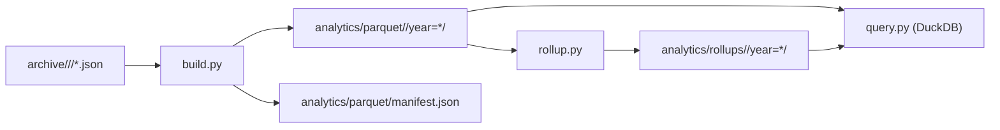

# py

This directory contains the Python analytics library and its tests for working with the
archived JSON data.

## Layout
- `gh_trending_analytics/` Build Parquet datasets, rollups, and query helpers powered by DuckDB.
- `tests/` Pytest suite covering build, rollup, query, and HTTP API behavior.

## CLI
The package exposes a CLI via `python -m gh_trending_analytics` with:
- `build` to convert archive JSON into Parquet datasets and a manifest.
- `rollup` to build rollup datasets used by analytics queries.

Example:
```bash
uv run python -m gh_trending_analytics build --kind repository --archive archive --analytics analytics
uv run python -m gh_trending_analytics rollup --kind repository --analytics analytics
```

## Architecture

