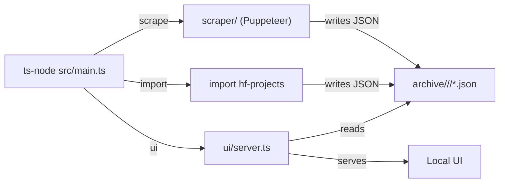

# src

This directory contains the TypeScript runtime that scrapes GitHub Trending and serves a
local UI over the archived data.

## Layout
- `main.ts` CLI entrypoint for scraping, imports, and the UI server.
- `scraper/` Puppeteer-based page parsers for trending repository and developer pages.
- `ui/` HTTP server and API that serves the static UI and archive search endpoints.

## Architecture


## Common commands
```bash
npm run start scrape <developer|repository> <archive-dir>
npm run start ui <archive-root> [--port=8787] [--bind=127.0.0.1]
npm run start import hf-projects <csv-path-or-url> <archive-root> [--skip-existing] [--overwrite] [--dry-run]
```
